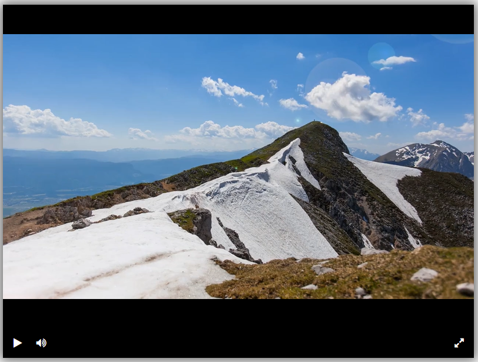

# Видеоплеер

Сайт представляет собой видеоплеер для проигрывания видео c кнопками управления.

Сайт расположен [здесь](https://ann2004.github.io/video-player/).



Кнопки управления плеером:
- Пуск / пауза
- Выключить звук / включить звук
- Сделать видео на весь экран

Указать видео для проигрывания можно с помощью аргумента `src` в index.html (ссылки обязаны заканчиваться расширением файла):

```html
<script type="text/javascript">
  createPlayer({
    elementId: 'player',
    src: 'https://dvmn.org/media/filer_public/d0/16/d016d9b8-4180-4bb9-ad83-0241f61627b8/samsung_demo_-_alive_in_color.mp4'
});
</script>
```

